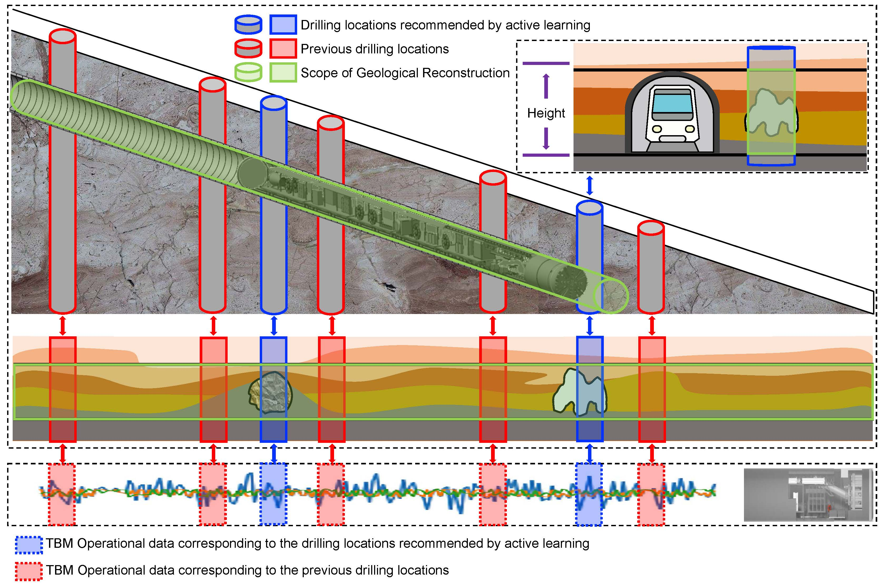

# AL-iGAN

Code for **Active learning framework for tunnel geological reconstruction based on TBM operational data**

Due to the confidentiality of the data presented in this paper, we are unable to provide it. 




# Usage
1. Install Python 3.7. For convenience, execute the following command.
```
pip install -r requirements.txt
```
2. Prepare Data. An example of a directory is as follows:
```
|GAN
    |---qbc (folder)
        |---0 (folder)
            |---data (folder)
                |---train_data (data file)
                |---train_label (data file)
                |---test_data (data file)
                |---test_label (data file)
                |---pool_data (data file)
                |---pool_label (data file)
                |---pool_data_unselect (data file)
                |---pool_label_unselect (data file)
                |---geoData (data file)
            |---model (folder)
            |---result (folder)
```
where 0 is the number of active learning times
3. Train and evaluate model. We provide the demo for all benchmarks in the file `run.py` and `run_other.py`
# Citation
If you find this repo useful, please cite our paper.
```
To be supplemented
```

